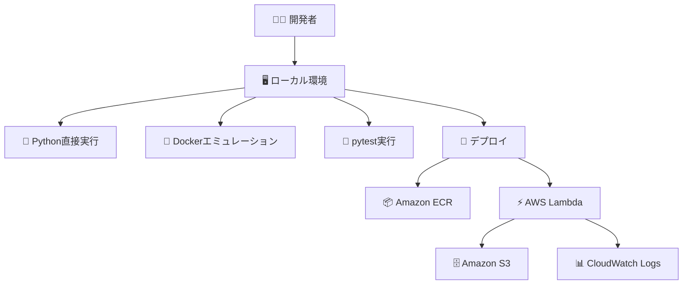

# AWS Lambda Python ローカル開発環境

[](https://www.python.org)
[](https://aws.amazon.com/lambda/)
[](https://www.docker.com)

> AWS LambdaのPython関数を効率的に開発・テスト・デプロイするローカル開発環境

## 📋 概要

このプロジェクトは、AWS Lambda関数の開発を効率化するための包括的なローカル開発環境を提供します。

**主な機能:**
- 🚀 ローカル開発・テスト環境
- 🐳 Dockerを使用したLambda環境エミュレーション
- ☁️ AWSへの自動デプロイ
- 📊 S3オブジェクト一覧取得のサンプル実装

## 🚀 クイックスタート

```bash
# 1. リポジトリのクローン
git clone <repository_url>
cd aws-sample-lambda-dev-local/python

# 2. 依存関係のインストール
uv sync

# 3. AWS認証情報の設定
aws configure

# 4. ローカルテスト実行
./scripts/test-local.sh
```

## 📋 前提条件

| ツール | バージョン | インストール方法 |
|--------|-----------|----------------|
| Python | 3.13+ | `brew install python` |
| uv | latest | `curl -LsSf https://astral.sh/uv/install.sh \| sh` |
| Docker | latest | [Docker Desktop](https://www.docker.com/products/docker-desktop/) |
| AWS CLI | latest | `brew install awscli` |

## 🔄 開発ワークフロー

### Step 1: ローカル開発

```bash
# 🐍 Python直接実行（高速フィードバック）
uv run python src/handlers/lambda_handler.py

# 🧪 単体テスト実行
uv run pytest tests/ -v
```

### Step 2: Dockerテスト

```bash
# 🐳 Lambda環境をエミュレート
./scripts/test-local.sh

# 📄 カスタムイベントでテスト
./scripts/test-local.sh resources/events/custom-event.json
```

### Step 3: AWSデプロイ

```bash
# 🚀 対話式デプロイ
./scripts/deploy.sh

# 🤖 CI/CD用自動デプロイ
./scripts/deploy.sh --auto-create
```

### Step 4: 本番確認

```bash
# ☁️ AWSでの動作確認
./scripts/test-remote.sh
```

> **💡 Tips:** 開発中は Step 1 → Step 2 → Step 3 の順で進めることを推奨

## 📁 プロジェクト構成

```
📦 aws-sample-lambda-dev-local/python/
├── 📂 src/                           # 🐍 ソースコード
│   └── 📂 handlers/
│       └── 📄 lambda_handler.py      # 🎯 メインのLambda関数
├── 📂 tests/                         # 🧪 テストファイル
│   └── 📄 test_lambda_handler.py
├── 📂 docker/                        # 🐳 Docker設定
│   └── 📄 Dockerfile                 # Lambda Runtime設定
├── 📂 resources/events/              # 📊 テストイベント
│   ├── 📄 test_event.json           # ローカル用
│   └── 📄 test_event_remote.json    # リモート用
├── 📂 scripts/                       # 🔧 自動化スクリプト
│   ├── 📄 test-local.sh             # ローカルテスト
│   ├── 📄 deploy.sh                 # デプロイ自動化
│   └── 📄 test-remote.sh            # リモートテスト
├── 📂 docs/                          # 📚 詳細ドキュメント
├── 📄 pyproject.toml                 # Python設定
└── 📄 uv.lock                        # 依存関係ロック
```

## 🎯 サンプル機能

**S3オブジェクト一覧取得Lambda**

| 機能 | 説明 |
|------|------|
| 🔗 **S3接続** | boto3を使用したS3サービス接続 |
| 📋 **一覧取得** | 指定バケットのオブジェクト一覧取得 |
| 🛡️ **エラーハンドリング** | 適切な例外処理とログ出力 |
| 📊 **ログ出力** | CloudWatch Logsへの詳細ログ |

```python
# 使用例
def lambda_handler(event, context):
    # S3バケットからオブジェクト一覧を取得
    objects = list_s3_objects(bucket_name)
    return {'statusCode': 200, 'body': objects}
```

## ⚙️ 設定とカスタマイズ

### 環境変数での設定

```bash
# 🏷️ Lambda関数名
export FUNCTION_NAME="my-custom-lambda"

# 📦 ECRリポジトリ名  
export ECR_REPOSITORY_NAME="my-lambda-repo"

# 🌍 AWSリージョン
export AWS_DEFAULT_REGION="ap-northeast-1"

# 📂 S3バケット名
export S3_BUCKET_NAME="my-test-bucket"
```

### デプロイオプション

| モード | コマンド | 用途 |
|------|--------|------|
| 👤 **対話式** | `./scripts/deploy.sh` | 手動確認ありのデプロイ |
| 🤖 **自動化** | `./scripts/deploy.sh -a` | CI/CDパイプライン向け |

### カスタムイベント作成

独自のテストケースを作成できます：

```json
// resources/events/my-event.json
{
  "bucket_name": "my-test-bucket",
  "prefix": "data/"
}
```

```bash
# カスタムイベントでテスト
./scripts/test-local.sh resources/events/my-event.json
```

## 🔧 トラブルシューティング

### よくある問題と解決方法

#### Docker関連エラー

```bash
# ❗ Docker未起動エラー
❌ Cannot connect to the Docker daemon

# ✅ 解決方法
1. Docker Desktopを起動
2. システムトレイでDockerアイコンが緑になることを確認
3. `docker ps` コマンドで動作確認
```

#### AWS認証関連エラー

```bash
# ❗ AWS認証エラー
❌ Unable to locate credentials
❌ The security token included in the request is invalid

# ✅ 解決方法
1. aws configure で認証情報を設定
2. ~/.aws/credentials ファイルを確認
3. aws sts get-caller-identity で認証状態を確認
```

#### ビルド関連エラー

```bash
# ❗ パッケージインストールエラー
❌ uv: command not found

# ✅ 解決方法
curl -LsSf https://astral.sh/uv/install.sh | sh
source ~/.bashrc  # またはターミナルを再起動
```

### プラットフォーム固有の注意事項

#### Apple Silicon (M1/M2/M3) Mac
- ✅ ARM64/AMD64の自動切り替えに対応済み
- ✅ 特別な設定は不要

#### ログ確認方法

```bash
# Dockerローカルログ
docker logs <container_id>

# AWS Lambdaログ
aws logs tail /aws/lambda/your-function-name --follow
```

---

## 📚 参考資料

### 📄 AWS公式ドキュメント
- [AWS Lambda Developer Guide](https://docs.aws.amazon.com/lambda/)
- [AWS Lambda Python Runtime](https://docs.aws.amazon.com/lambda/latest/dg/lambda-python.html)
- [AWS CLI設定ガイド](https://docs.aws.amazon.com/cli/latest/userguide/getting-started-quickstart.html)
- [AWS ECR User Guide](https://docs.aws.amazon.com/ecr/)

### 🐍 Python関連
- [Python開発環境をVSCode + uvで整える](https://qiita.com/ebimontblanc/items/8a0a52b10a82ba800ea5)
- [uv: Pythonパッケージマネージャー](https://docs.astral.sh/uv/)
- [pytestドキュメント](https://docs.pytest.org/)

### 🐳 Docker関連
- [Lambda Runtime Interface](https://docs.aws.amazon.com/lambda/latest/dg/python-image.html)
- [Docker公式ドキュメント](https://docs.docker.com/)

<details>
<summary>🔧 技術詳細・アーキテクチャ情報</summary>

## 📐 技術アーキテクチャ

### システム構成図



### 🔧 技術スタック詳細

| カテゴリ | 技術 | バージョン | 役割 |
|---------|-----|-----------|-----|
| **実行環境** | Python | 3.13+ | コア実行環境 |
| **パッケージ管理** | uv | latest | 高速依存関係管理 |
| **テスト** | pytest | ^8.0 | 単体テスト実行 |
| **AWS SDK** | boto3 | ^1.34 | AWSサービス連携 |
| **コンテナ** | Docker | latest | Lambda Runtime Interface |
| **インフラ** | AWS CLI | latest | デプロイメント自動化 |

## 🏗️ アーキテクチャ詳細

### ローカル開発フロー

#### 1. 直接Python実行
```python
# 高速フィードバックループ用
# メリット: 起動高速、デバッグ容易
# デメリット: 環境差分の可能性

if __name__ == "__main__":
    # ローカルテスト用のイベント
    test_event = {"bucket_name": "test-bucket"}
    result = lambda_handler(test_event, None)
    print(result)
```

#### 2. Dockerエミュレーション
```dockerfile
FROM public.ecr.aws/lambda/python:3.13
# Lambda Runtime Interface Emulator使用
# メリット: 本番環境に近い
# デメリット: 起動やや重い
```

### AWS デプロイメントフロー

#### ECRプッシュプロセス
```bash
# 1. イメージビルド（マルチアーキテクチャ対応）
docker buildx build --platform linux/amd64,linux/arm64

# 2. ECRログイン
aws ecr get-login-password | docker login

# 3. タグ付けとプッシュ
docker tag local-image:latest $ECR_URI:latest
docker push $ECR_URI:latest
```

#### Lambda関数更新
```bash
# 関数が存在しない場合の作成
aws lambda create-function \
  --function-name $FUNCTION_NAME \
  --code ImageUri=$ECR_URI:latest \
  --role $LAMBDA_ROLE

# 既存関数の更新
aws lambda update-function-code \
  --function-name $FUNCTION_NAME \
  --image-uri $ECR_URI:latest
```

## 🧪 テスト戦略

### テスト階層

```
🧪 テスト戦略
├── 📝 単体テスト (pytest)
│   ├── 関数ロジックテスト
│   ├── モック使用によるAWSサービステスト
│   └── エラーハンドリングテスト
├── 🐳 統合テスト (Docker)
│   ├── Lambda Runtime Interface Emulatorテスト
│   ├── 実際のイベント形式テスト
│   └── レスポンス形式検証
└── ☁️ E2Eテスト (AWS)
    ├── 実環境でのLambda実行
    ├── 実際のS3との連携テスト
    └── CloudWatchログ確認
```

### テストデータ管理

```json
// resources/events/test_event.json
{
  "Records": [
    {
      "eventSource": "aws:s3",
      "eventName": "ObjectCreated:Put",
      "s3": {
        "bucket": {"name": "test-bucket"},
        "object": {"key": "test-file.txt"}
      }
    }
  ]
}
```

## ⚙️ 詳細設定管理

### 環境変数設計
```bash
# デプロイメント設定
FUNCTION_NAME="lambda-s3-processor"      # Lambda関数名
ECR_REPOSITORY_NAME="lambda-repo"        # ECRリポジトリ名  
AWS_DEFAULT_REGION="ap-northeast-1"      # デプロイ先リージョン

# ランタイム設定
S3_BUCKET_NAME="data-processing-bucket"  # 処理対象バケット
LOG_LEVEL="INFO"                         # ログレベル
TIMEOUT_SECONDS="30"                     # タイムアウト設定
```

### IAMロール設計
```json
{
  "Version": "2012-10-17",
  "Statement": [
    {
      "Effect": "Allow",
      "Action": [
        "s3:GetObject",
        "s3:ListBucket"
      ],
      "Resource": [
        "arn:aws:s3:::your-bucket",
        "arn:aws:s3:::your-bucket/*"
      ]
    },
    {
      "Effect": "Allow",
      "Action": [
        "logs:CreateLogGroup",
        "logs:CreateLogStream",
        "logs:PutLogEvents"
      ],
      "Resource": "arn:aws:logs:*:*:*"
    }
  ]
}
```

## 🔧 パフォーマンス最適化

### ビルド最適化
- **マルチステージビルド**: 不要ファイル除去
- **レイヤーキャッシュ**: Docker buildでの高速化
- **依存関係最小化**: uv.lockによる確定的ビルド

### Lambda実行最適化
- **コールドスタート削減**: コネクション再利用
- **メモリ使用量最適化**: プロファイリング実施
- **エラーハンドリング**: 適切な例外処理

## 🚨 監視とロギング

### ログ出力戦略
```python
import logging
import json

logger = logging.getLogger(__name__)
logger.setLevel(logging.INFO)

def lambda_handler(event, context):
    # 構造化ログ出力
    logger.info(json.dumps({
        "event": "lambda_start", 
        "request_id": context.aws_request_id,
        "event_data": event
    }))
    
    try:
        result = process_s3_event(event)
        logger.info(json.dumps({
            "event": "lambda_success",
            "result": result
        }))
        return result
    except Exception as e:
        logger.error(json.dumps({
            "event": "lambda_error",
            "error": str(e),
            "request_id": context.aws_request_id
        }))
        raise
```

### CloudWatch監視
- **メトリクス**: 実行時間、エラー率、メモリ使用量
- **アラーム**: エラー率閾値、実行時間異常
- **ダッシュボード**: リアルタイム監視

</details>

---

## 📜 ライセンス

このプロジェクトはサンプル・学習目的で作成されています。

### 連絡先
サポートや質問がありましたら、[Issues](../../issues)でお知らせください。
